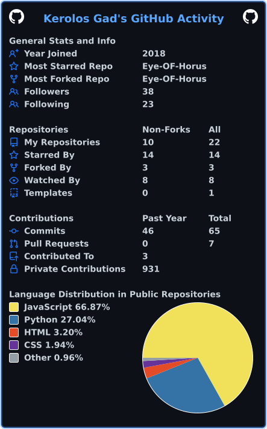
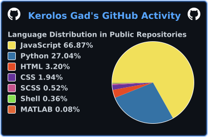

# Hi 👋, I'm Kerolos Gad

### Software Engineer & Tech Consultant

- 📫 Reach me at **contact@kerolosxgad.com**
- 👨‍💻 Projects: **[kerolosxgad.com](https://www.kerolosxgad.com)**
- 📝 I write at **[kerolosxgad.com/writing](https://www.kerolosxgad.com/writing)**

### Connect

<!-- shields.io (badges/shields, open source) - static badges, no upstream API to fail -->

### Languages and Tools

<!--
  devicons/devicon + simple-icons, served from jsDelivr.
  Both are open source icon sets and jsDelivr is a static CDN:
  no GitHub API call, no token, nothing to rate-limit.
-->

  
  
  
  
  
  
  
  
  
  

  
  
  
  
  
  
  
  
  

  
  
  
  
  
  
  
  

  
  
  
  
  
  
  
  
  
  

---

<!--
  Everything below is a local .svg file in THIS repo, regenerated daily by
  .github/workflows/profile.yml. No live third-party service is contacted when
  someone loads your profile, so nothing can rate-limit or 502 on you.
-->

### Stats — cicirello/user-statistician

### Trophies — ryo-ma/github-profile-trophy (action mode)

### Activity — lowlighter/metrics + Platane/snk

